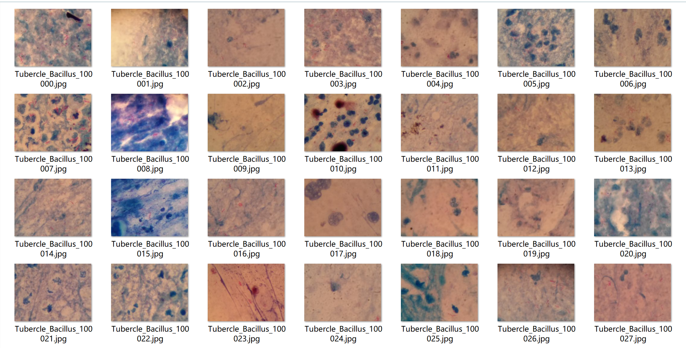
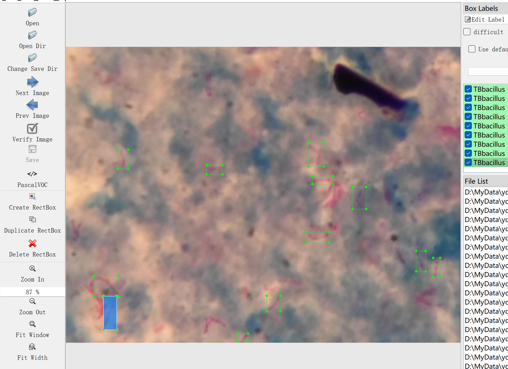
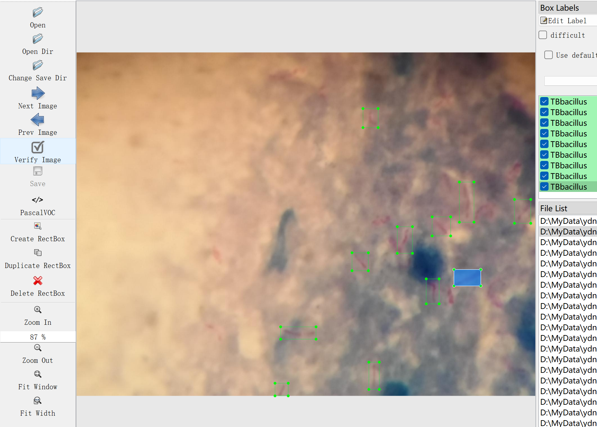

# TBbacillus Target Detection Dataset

Dataset Information Introduction: A total of 1218 images and their corresponding annotation files are included in this dataset. The annotation files are labeled as follows: 'TBbacillus' for Mycobacterium tuberculosis, with a total of 9969 instances. Note that each image may contain multiple objects, resulting in an overall count of annotations exceeding the number of images.

The dataset is divided into three folders and one txt file:
- all_txt folder and classes.txt: Store yolo format txt annotations, matching the number of images, and each annotation file is directly associated with an image.
- classes.txt:
- all_xml file: VOC format xml annotation files. The number of annotation files matches the number of images, and each annotation file is directly associated with an image.

To understand the VOC standard file format in detail, please search it on your own. Both formats are usable; choose one based on your preference.

Screenshots of the annotation effect:

## Image

Here is a pay link on Stripe ( https://buy.stripe.com/3cs8yP7sY87d0vu9AB ). Please contact me lonlonago@foxmail.com after funding $89, and I will send you a complete data files , thank you!

